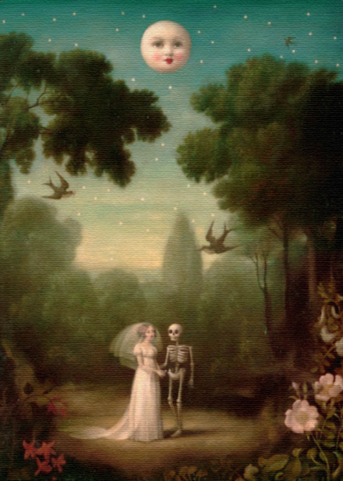

<small>Photo from <a href="http://www.stephenmackey.com/">Stephen Mackey</a></small>

I’m sitting on a bench sun bathing. I have rolled my gym shorts and sit in the most optimal position for sun exposure. I have four books stacked beside me, slowing toasting in the sun. In Korea, public libraries allows only 5 books per person, and I’m currently reading the last one. Ironically, it is about love, the study of love, about why we love, what is love. Just as I start to make sense of the idea behind the book, a couple walking in through the park declare their love to each other. 

“I really love you, you know that?”

The girl shrieks.The boy grabs her waist. An aggressive gesture. I can’t help it: 

“Hmph!” I snort my nose, looking at them. 

They stop in their tracks. They look down at me. I express my disdain through a steady stare. 

We stare at each other for a suspended time. Slowly, they start to walk away. I go back to reading my book again. 

… 

I am in Seoul, South Korea. I have currently escaped my life in Canada to be here. I quit school, I quit connections, stopped doing a lot of things quite suddenly. I came here, where I was born, to try to discover something. I’m not even quite sure what that is, to be completely honest. 

The culture here is so different. Like this book. Books like this would be quite difficult to be published back in Canada. From what I have read from Kang Yeung Gae so far, she seems to think love is a tangible item. She believes love is a constant yearning for human beings, since the first moment we were born into the luminescent light of hospitals and in the warmth of our mothers embrace, we became instantly addicted to the substance called love. According to her, we associate it with protection, safety, happiness, euphoria. 

“Hmph,” I snort my nose again, this time at the book on my lap. 

I beg to differ, Miss Kang. I tend to believe the idea of love is fabricated, not original. Love holds a potential danger to be fabricated. Too often we are forced to believe in the absolute existence of love that is to be discovered. It is like ritual in having a life: a responsibility to find your true love. As if there is only one person in this entire universe for you. In relationships, partners begins to accumulate embodiments of ideal traits, and force it upon each other. Before long, it is no longer two people in a relationship; they leave their bodies and they become two beings fantasies dreaming about another couple, imaginary and forever unattainable. At least, that’s what I’ve known all my life, anyway. In too many relationships, people set themselves up for the very fall that dug on their own. 

I do not believe in love the way others believe in it. I don’t believe in love that you see in movies, the kind that we are forced to believe. I believe in love between a family, maybe friends, but I am a bit weary of romance. How can you love someone, when you constantly have a way out of the relationship? 

I have never experienced a kind of love that made my axis on this world turn upside down. I am here, nothing about me have changed. Moments of temporary despair can be cured with a glass of wine. The tracks of heartaches can be covered by the number of days that have gone by. Your age can reset past mistakes, a good book can give you hope again. 

Love is perhaps the simplest thing on earth. But the idea of how we are supposed to behave when in love constantly trips me.