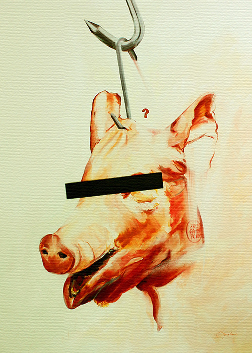

<small>Photo from <a href="https://merrysparks.com/the-cold-room-no-3-who-is-the-victim/">Merry Sparks</a></small>

I was walking through a beautiful street market today in South Korea today, and I saw exotic foods of all kinds until I noticed something peculiar. I saw a butcher’s shop, full of different types of meat on their display. The red lights and the scent of blood drew me in, and I naturally looked inside. I expected to see a marbled steak or a leg of lamb. No, it was dog – sliced halfway length wise. I looked up in horror at the butchers’ smiling faces while their innocent brown eyes looked ready for business. 

I ran out of there in disgust. 

But as I was walking away into busy streets of Seoul I paused and thought: ‘Wait, why am I disgusted? It’s just meat, you eat it every day in one form or another do you not? Compared to the Foie Gras it’s nothing, really. And was there not a chicken head beside the dog carcass? Why didn’t I find that disgusting?’ It’s all disgusting or not disgusting at all. I laughed at my own hypocrisy. 

These days we have an interesting relationship with food. We cannot see the miracle in our daily lives as we enter the superstore; the endless amount of choices and quantity of meats at our finger tips. ($1.99! chicken “meat” for sale!) The cause of such abundance needs to be questioned. We are so far removed from the realities of the food industry and their wrongdoings, especially concerning the handling of animal products for consumption. And the truth is that the majority of us would rather stay ignorant in fear of it ruining our appetite. Most of us are blinded and we like it that way. Sympathy is an emotion that cost too many calories to feel and we cannot be bothered to exercise such emotions towards the animals that we eat. 

Everything comes packaged to us: I often forget that the grind up meat that says beef is actually a cow. They mean the same thing, sure, but if you were in the factory that processed the cow into beef you would realize one has a much more sinister meaning than the other. In fact, if I was constantly reminded of what actually goes on into the butchery of animals that we eat, I would have to excuse myself from the dinner table every time. There have been many recent attempts to make America and the rest of the world eat less meat. Meatless Mondays, banning dairy milk in school, vegan this vegetize that, tofu burgers and tempeh bacon – you name it. These are good ideas to make the world eat less meat as far as I am concerned. But for some, the vegan lifestyle is too extreme a diet that sounds unappetizing for many meat consumers. But as unappetizing as some vegan dishes may sound, we need to admit that meat consumption is unappetizing too. Yes, some Koreans eat dog meat in a stew called Bo-Shin-Tang. Other cultures eat “freaky meats” and delicacies too, including our own – a steak or a mcburger is meat too, have you noticed? What is more ethical or not is your opinion, but everyone should realize meat consumption itself is an unappetizing practice. We are all part of the meat consuming culture. 

I am not vegan. This is not a vegan article encouraging readers to become vegans or vegetarians. I say you should never feel guilty for what you choose to put in your mouth; but I think you should feel guilty for choosing to stay ignorant to the realities of the food industry. The billions of dollars spent to keep consumers blinded – our population’s health problems and the fact that we have accepted diseases and cancers as the norm, our severe dependence on medicine and attitudes that expect hospitals to fix what could have been preventable, and children who are taught to eat to accelerate death, not prolong it. We turn around and then ask the question with the answer that is staring at us right there on the plates: “Why are we so sick?” 

We need to stop being spoon-fed and take responsibility for what we are putting in our mouths. We need to want to know where our food comes from: For ethical reasons, health reasons, political reasons, it is just common sense – it is a fundamental right. We need to learn to exercise this right that we have in this country. How can we aspire to be anything if we are what we eat, and we do not even know what we are eating? 

Many of us don’t question what we eat; we care what our appetite has to say and nothing else. Whether it is the man’s best friend, the innocent duck, or the cow that is diseased and beaten until it is served onto our plates, it all doesn’t matter for the most of us; the humankind is a species that seeks only the most gastronomically pleasing creations out there. And this appetite that we have for the flesh is a hard one to reverse. On top of our culture’s addiction to meat, we also have this misconception that the government is taking care of the food that we are eating, so that we don’t have to take the necessary health precaution when we buy meat from our groceries or when we go out to many of our favourite restaurants. The discomforting truth is that the food industry fails everyday to properly produce meat products that is up to both the moral and health standards of the average citizen. Yet we live each day consuming these products because we are so disconnected from the sources of our food. 

With these odds against us, we as a meat consuming culture are very disadvantaged to reverse our population’s diet into a plant based one. So maybe it is too late for the majority of us. But I say our children deserves better than the government’s half-assed attempt to control the foods we are eating. Children really do not deserve to eat the mess of processed foods that we have labelled as edible. As adults we need to feed our children better, teach them that excess is not necessary in every meal, and we need to condition their taste buds to crave the healthy, not the unhealthy. Our parents have failed in that retrospect. And who can blame them? They didn’t know any better. But we know better, and we have no excuse to pass on our unhealthy lifestyles and diseases onto our children. It may be tragic that it is too late for us, but it would be detrimental if it was also too late for the next generations. The resources of this land will die out and we need to teach our children to survive if they are going to continue to live on this planet – in good health and respect for their environment. 

It may be impossible for humankind as a species to break out of their meat culture – but we can all make an effort.