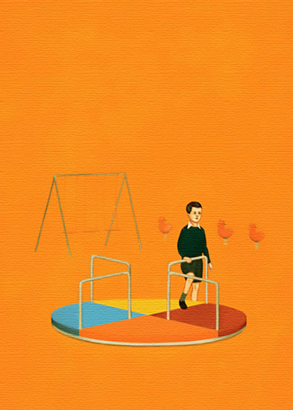

<small>Photo from <a href="http://edwarddelrosario.com/">Edward del Rosario</a></small>

When I first arrived in Canada, in my size 5 Spider-Man shoes with my doggy shaped backpack, I didn’t speak a word of English. My mother and I stayed in a public housing, with groups of international immigrant families staying under one roof. And I remember since the first day, I was shooed away to go play in the local park, and encouraged to make friends. In the playground, there was a swing, a monkey bar, a teeter-tootle, as well as other plastic and Crayola-coloured play things. After a few days of contently playing by myself and enjoying the playground all to myself, I eventually ended up playing in the park while other kids were playing there as well. 

They were not that nice to me. They pushed me aside from the swing, so I would try to go play on the monkey bars, only to be pushed away to the teeter-tootle, only they didn’t want me playing there either. Sooner or later I realized they just wanted me out of there, and wanted the whole playground to themselves. Being a shy kid but still stubborn as a rock, I stayed, holding back the tears. 

Then this one boy, showed up out of nowhere and grabbed my hands and took me by the swing. He pushed off the kids that were playing there, and got on one of the swings himself. 

He smiled at me, assuring me I could go on the other swing as well. His name was Robert. We became friends. He made a public announcement on top of the monkey bars to the rest of the kids – declaring me king of the playground. And ever since then the other kids did not bothered me. Robert was my first friend in Canada. His skin was coffee coloured, had curly brown hair, and had the biggest, widest smile. He was the first person who taught me that people here were nice too. That they also enjoyed playing hide and seek, or play Dragonball Z, or tag. And that despite my accent or how I looked, they could treat me as one of their own. With my friends, I was never aware that I was ever different from them. 

I am 21 years old now. And I am constantly and always aware that I am different from my peers. I have dual identities, as a Canadian and as a Korean. I speak two languages, and I compare what is different or similar here to back to home. I have to keep up with two trends. Two cultures. People treat me differently when I don’t open my mouth here. 

I sometimes wish Robert will appear again, declaring to the world the equality and my rightful place to be on this playground. Tall and proud. I want him to be by my side, just as he was when we were little, being a beacon of strength and of childish pride. Someone from the inside who can understand what it is like to be someone from the outside. Who feels for the little guy, for the underdog. Someone who is admirable because they have the strength to show their empathy.