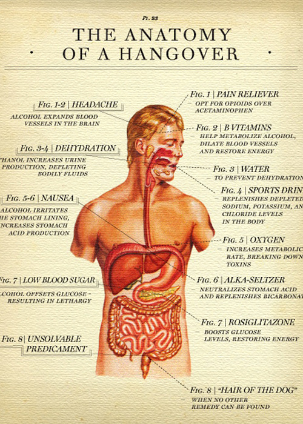

<small>Photo from <a href="https://t.umblr.com/redirect?z=https%3A%2F%2Fwww.flickr.com%2Fphotos%2F35221084%40N08%2F3432086555%2F&t=NTI2M2EwMDA5Y2JjMjc4MDFmYWNkODQ3ZTZmYmUwOTRiODdlMjkzMCxPSmZhZnF1TA%3D%3D&b=t%3A2tF3hWVD2lUpt_wUkxXQjw&p=https%3A%2F%2Fjuded.tumblr.com%2Fpost%2F146080553822%2Fanatomy-of-a-hangover&m=1">Sloshspot</a></small>

Hangovers are defined in the medical dictionary as “the disagreeable psychological and physiologic effects after heavy consumption of drugs or alcoholic beverages, including nausea, headache, sensitivity to light and noise, lethargy, dysphoria, and thirst.” 

In other words, they can be deadly unpleasant. Unpleasant enough, in fact, that they have a significant effect on the economy. In a British 2004 survey, it was found that over 78% of workers have admitted to calling in sick due to a hangover. That rounds up to around two billion pounds in lost wages each year. Hangovers are a nationwide epidemic. 

Many people are familiar with the feeling of the post-alcohol morning-after, when the sun becomes the enemy and the neighbour’s barking dog becomes the most irritating thing on the planet. How do hangovers have the ability to make last night’s excesses seem like such a bad idea? 

The exact cause of hangovers is still a mystery. The 2008 journal of Alcohol & Alcoholism describes: “The alcohol hangover is an intriguing issue since it is unknown why these symptoms are present after alcohol and its metabolites are eliminated from the body.” To answer the lingering questions about this illness, here are a number of possible culprits for the hangover: 

CYTOKINES 

A chemcial messenger known as cytokines are believed to be a cause of the horrible symptoms the body suffers after consuming alcohol. The soluble proteins are responsible for regulating inflammation, immune responses, and trauma. Cytokines levels in the human body are known to be altered when they come in contact with alcohol, and results in the negative symptoms associated with hangovers. 

DEHYDRATION 

Dehydration is also considered to be a culprit for the hangover, where research has shown that approximately 100 ml of additional urine output occurs for every 10 ml alcohol consumed. Alcohol consumption promotes urine production and prevents the kidneys to retain water. Limited water supply to the brain results in many of the symptoms similar to hangovers such as headaches, dry mouth, nausea and fatigue. However, new researchers are growing skeptible of attributing dehydration as the sole cause of hangovers, since there are more chemical reactions that take place with the exposure of alcohol in the human body. 

CONGENERS 

Congeners are a byproduct of fermentaion in some alcohols, and considered to be a possible cause for the severity of hangovers. There is a higher prescence of congeners in drinks such as bourbon, tequila, scotch, brandy, red wine, and dark beers, which might explain why some people avoid certain drinks in the fear of a worse hangover. 

OTHER FACTORS 

It should be noted that the severity of hangovers are dependent on various factors, such as the amount of sleep the individual has gotten prior to drinking and after a hangover, the individual’s BMI (Body Mass Index), blood sugar levels, pre-existing medical conditions, the combination of alcohol with various other drugs, and the alcohol tolerance of the drinker depending on their gender and race. Alcohol reacts differently with each individual, where some are genetically made up never to experience hangovers, while others may have mutated genes that prevents the breakdown of alcohol in the body. Hangovers are complex reactions that takes all these factors into account, and this results in varying degrees of symptoms that an individual may suffer from excessive drinking. 

Despite the various experiements done for possible answers for the causes of hangovers, the cure for the illness remain elusive. Ask any social drinker for their hangover cures and they will give a variety of different answers. During the Prohibition era, a 1930’s book by Virginia Elliott and Phill D. Strong stated: “A well-tried theatre remedy is one tablespoon of Worchestershire sauce in a wine glass of water. If the patient is an ingenue of delicate consititution, four strong men will be able to hold her while the dose is being administered.” Now that is quite a visual. 

As ridiculous as some cures may seem, everyone seems to have their own opinion about how to cure a hangover. Here are a collection of the most popular urban myths surrounding the hangover cures, outlined below. Note: The effectiveness of these cures are not guaranteed. 

“ORDER OF INTAKE” 

The general theory is that the order of different types of beverages will prevent a hangover. The term “beer before liquor never been sicker”, insists drinking beers before hard liquor will prevent hangovers. Some believe that wine do not cause hangovers at all. 

“WATER” 

Drinking water before and after consuming alcohol is believed to cure a hangover. While this might be true for some, for others, no matter how much water they drink hangovers can still result in the morning. 

“HAIR OF THE DOG” 

In modern literature, there is an astonishing amount of “remedy” recipes that claim to be the almight cure for hangovers. The concoction usually include alcohol, where the idea is to drink more alcohol, to combat the hangover. 

“PAIN KILLERS” 

Pain relievers are generally believed to be the answer, yet doctors warn their use for their potential to be harsh on your post-alcohol organs. Ibuprofen is recommended by some doctors, while other doctors say their reaction with alcohol are dangerous for the liver. Confused yet? 

“VITAMINS” 

Certain vitamins, such as Vitamin B12 is thought to promote normal functions of the brain and promote circulation, that could potentially help the alcohol leaving the body sooner. 

“BURNT TOAST” 

known as the “burnt toast” cure, the idea is to layer the stomach with activated charcoal to filter the body against the harmful effects of alcohol. Sidenote: Burnt foods do not contain activated charcoal, they just taste very bad. 

“FOOD COMBINATION” 

Certain food combinations, or certain nutrients in the specific food item are considered to be the cure for hangovers. A popular notion is that greasy food lines the stomach with oils that will block it from absorbing the alcohol.

Hangovers remain to be a puzzling illness. Since the begininng of civilization, it has inflicted men and women throughout the centuries. Hangovers will always be a part of society and be a lingering malady that can severely affect our ability to function correctly. Until the exact cause of the illness is understood, it seems the only way to combat hangovers is to control the intake. If that is not possible, as it may well prove to be, it may be worth it to adopt a hangover cure. It may or may not be effective, but it does give drinkers a licence to drink.
