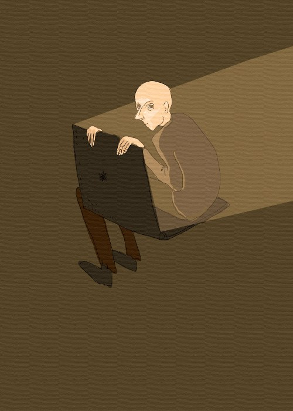

<small>Photo from <a href="https://paula-youth.tumblr.com/image/60052570147">paula-youth</a></small>

I don’t even know how or when it started. But ever since puberty, I stayed up all night in the darkness of my room, with only the moon and the computer screen shining light on my hunched-back figure. Unfortunately this habit has continued to become my daily night ritual. Why am I always up at night on my computer? Am I an internet addict? 

Stress is described to affect mammals in critical ways. When mammals are faced with stress, they go through a 3 stage process called the general adaptation syndrome. First, at the onset of seeing a threat, the body goes into the alarm state, where the body respond by increasing the physiological responses such as releasing adrenal hormones and increasing blood pressure. Next, it enters the resistance stage, where it continues to react in a highly unstable way until finally, the body hits the exhaustion stage, where the body’s resources are depleted. At this stage, the mammal often just lies on the ground, lethargic and lifeless, gives up to be eaten by the predator. 

Many of us humans in society are constantly either in the resistance stage at any given moment in our lives. With work, debt, ill-health, relationship problems among other things, it is not surprising to find our bodies becoming more and more stressed with each passing year. Many of us deal with stress in unhealthy habits. Eating a poor diet, consuming too much, smoking too much, binge-watching Netflix, obsessively scrolling newsfeeds, or other methods of consuming the internet. Internet addiction has been categorized as a common coping mechanism for stress in by experts in the field of psychology. The excessive need to check social media, to discover more online sites and posts, online shopping, and the constant lookout for notifications are all behaviours of those with warning signs for high levels of stress. People indulge the internet like they indulge food, or drugs, or unhealthy behaviours. It is a way of our bodies to to redirect their attention from the true source of their stress. We find ourselves constantly in the exhaustion stage, with all our resources depleted and no way to rejuvenate our bodies. 

Classic symptoms of an internet addiction include: The inability to accomplish daily tasks, losing track of time online, neglecting family and friends, interference from school or work, restlessness when away from phone or computer, and irregular sleep patterns. 

If you experience any of the symptoms above, it may be time to reduce your internet usage. And from what I see on my dash, that’s the majority of us. You might just be using the internet as a way to avoid dealing with the real tasks, duties, responsibilities, and sources of stress in your life.
