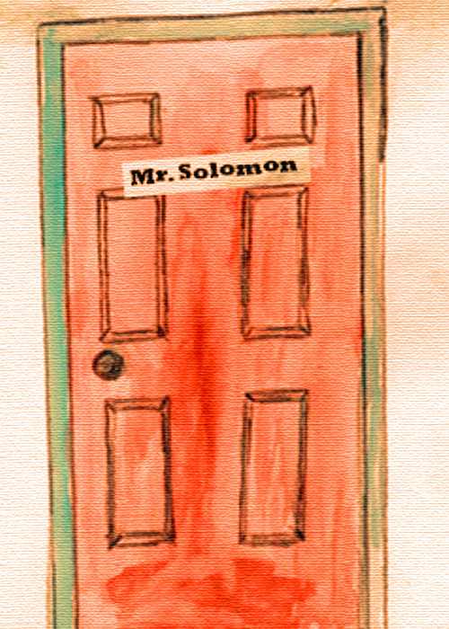

<small>Photo from <a href="https://t.umblr.com/redirect?z=https%3A%2F%2Fwww.google.ca%2Fsearch%3Fsa%3DG%26hl%3Den-CA%26q%3Ddoor%2Bto%2Bdoor%2Bmarketing%26tbm%3Disch%26tbs%3Dsimg%3ACAQSlgEJlMYR301uOBMaigELEKjU2AQaBAgGCAgMCxCwjKcIGmEKXwgDEifXBaQBhwGdAfADhgGnAZAICtQF3irjJ-Qn9zXbKtwq2SKAKOAn-zUaMApKxb7aCRVJSp0U74oiLBgO5n5uYsRO50oF1MkWtKrhNF_1KAkjpLFE4sqMfSybi2yADDAsQjq7-CBoKCggIARIEMG3RAgw%26ved%3D0ahUKEwi8-9i-m7DNAhXkpYMKHTKxCFgQwg4IGygA%26biw%3D1366%26bih%3D599&t=YTM0NzI2YjdlNjE2MTQ2YmJhMzZlMmIxMzM2NDcwN2MwNmVjMDViOCxyNllia2picw%3D%3D&b=t%3A2tF3hWVD2lUpt_wUkxXQjw&p=https%3A%2F%2Fjuded.tumblr.com%2Fpost%2F146082506842%2Fmr-solomon&m=1">Google</a></small>

I was a very, very depressed teenager. 

It started when I was 15. A steady taste for black clothes, skull t-shirts, and bangs so long it would block half my sight. Like a transmutation into a wild werewolf; I was growing up, and reacting to what I was seeing around me. 

And then - the infamous meltdown. It was an average day, I came to school late as usual, made my morning pilgrimage to the vice-principle’s office, and made my way up to my locker. There was a break-in at the school that day, and I found my locker was missing my wallet, ipod, and bus pass. Looking back at it, I think it was the bus pass that got me. In the middle of fourth period, chemistry, I stood up and told Mr. Bloch I wasn’t feeling well. I walked out. 

I could not take the laughter. The loneliness. I was the friendless Asian kid who played the piano alone at lunch time. The school freak who never had any friends and only looked out the window in class. I felt like there was no one I could trust. I didn’t even bother to report the fact that I had no means of getting to school the next day. I walked home, the entire 90 minutes of it. The good thing about winter is that the tears never quite last long in the cold. 

It’s funny how when you look back, you only now realize how abnormal those thoughts were, how disturbed you acted, how immense the pain you carried were - it takes a step out of the chaos to realize how unbearable it all was. 

I probably thought about never going back to that school. I probably thought about dropping out and being a gypsy. Probably even wanted to kill myself, because at that age it seemed like the only option. 

I met Mr. Solomon when he called me into his office. 

“Are you the kid whose locker was broken into?”
“Yes.”
“Well, come and sit down you goof.” 

I’ve never met or sat down with a guidance counsellor before, but somehow I found myself at my wit’s end in front of this man. I poured out everything to the first person who seemed to care about me. I don’t remember the exact things I said, but I do remember that it was the first time I ever cried in front of somebody at that school. The 3 miserable years of being an outsider, being parent-less and lonely, it all came pouring out in a state of frenzy. A classic nervous breakdown. 

“Is that all?”
“Yes.”
“Okay, the wallet - we can’t do much about, because it’s gone. The ipod - we have a whole entire collection of them in the lost and found box, and I’ll let you take whatever that you want. And for the bus pass, I don’t know why you didn’t come to us sooner, because we can provide you with passes from now on. You just had shitty luck. Deal with it.” 

From that morning on, Mr. Solomon would casually come into my morning class to “chat” with my math teacher, but I knew he was really checking up on me. Every morning, he gave me a wink on the way out, making sure I got to school safely that day. 

I can say with confidence the only reason why I survived high school was thanks to Mr. Solomon. 

It’s funny how in an institution of 2000 people, most of them your peers in your own age, there is not a single person a kid feels safe enough to open up to. The school system gets jaded by the schedule, and the countless many faces. But it takes one. Nobody gave me a chance in those hallways, and I fully mean this when I say this: It only takes one. We see proof in the number of teen suicide across this country. 

If it wasn’t for Mr. Solomon, I never would have made it out of there.
