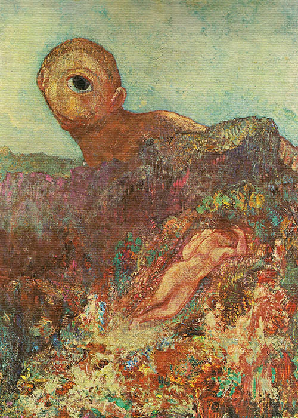

<small>Photo from <a href="https://krollermuller.nl/uniek-in-elk-seizoen">Odilon Redon</a></small>

We spend a third of our lifetime sleeping, and thereby have the opportunity to dream on any given night. Dreams create alternate universes, bizzare realities, and constant placement of objects and characters in foreign situations. They are considered to be a source of inspiration for many creative individuals, and they can provide a rare insight into the human imagination. 

All mammals dream. Owners of a furry pet are probably familiar with the sight of their cat or dog dreaming while they nap. I once had a dog that seemed to get nightmares in her sleep, and she would bark with her paws ferociously chasing after something in her dream. Humans dream as well, but our dreams can be a bit more complex than chasing down a squirrle. In our dreams, there are limitless possibilities of events, plots, objects that can be created. But why do we dream? Is there meaning beyond the nonsense? 

Dream researchers have now distinguished two major types of dream humans can have on any given night. The two types of dreams are categorized according to the state of sleep in which the dreams occur, known as non-REM sleep, and REM sleep. During a course of a night, we go through a series of sleep stages known as REM (Rapid Eye Movement) sleep, with stages that vary from light to deep sleep. Professor Patrick McNamara of Boston University have distinguished the two types of dreams we have in the stages of sleeping.“During non-REM sleep, our dreams can be taken as a process in which our brain take our memories and incorporate them to the future. Any experiences we obtained during the day might be played out in our dreams.” From comparing dreams of many subjects in his experiment, he has found that all images in our dreams are from memory. For example, in our dreams we cannot construct a face we have never seen before, it needs to be a face that we have seen. Throughout the long night, our dreams organize the data it has accumulated throughout the daytime. 

A recent study by Professor Robert Stickgold from Harvard Medical School have discovered a key characteristic of the dreams we have during REM sleep. “It was recently found that unlike non-REM sleep, REM sleep boosts creativity REM dreams occur during the third or fouth stages of sleep. During these stages we can experience more intense dreaming. Our brains uses the experiences from the past and place them in an imagined, made-up world. The future is unknown, and our dreams reflect that lack of knowlegde by creating a fictional world that forces us to take action or experience the dream. Therefore, during REM sleep our brain is preparing for the future by placing ourselves in new, foreign situations, and we are allowed to live out the possible future without consequence.” Dream researchers believe that since the future is unknown to us, our brians compensate the unpredictability of the future by attempting to create new realites. Despite the fact that the world operates in a logical sequence, our brains seek to prepare us for the upcoming events in the future. This highly evolutionary theory is gaining popularity, where dreams might simply be our brains attempting to reach maximum potential of our human experiences. 

This theory also explains why so many people believe that dream symbolism can predict the future. In its struggles to prepare us for the future, our brains might display a future that may come true in our dreams. >> Dreams can be the birthplace of creativity. Our imagination creates the freedom of the human mind to explore what can be. In dreams, we get to experience a reality that is made with no restriction to the physical boundaries of our daily lives. Many artists have taken advantage of this phenomenon, where these nightly adventures have been used for creative inspiration throughout history. Well known works of art by artists, painters, writers, film-makers have gained their inspiration from dreams. 

Odilon Redon (1840-1916) was a symbolist painter who also drew inspiration from the subconscious. The unrealism of dreams and imagination have been the source of his works of art. The Cyclops, was dreamed by Redon in the height of his career, when he dreamt of the mythical creature poking its head out on a moutain, symbolic of nature that is unhindered by reality. The colours and the idiosyncratic nature of the work depicts a world only possible in a dream, and a new take on the mythical creature as timid, curious beings rather than tyrant and dangerous.

From Mary Shelly’s Frankenstein, Lewis Carroll’s Alice’s Adventures in Wonderland, Robert Louis Stevenson’s The Strange Case of Dr. Jekyll and Mr. Hyde, to Franz Kafka’s The Metamorphosis, dreams have produced mind-blowing works or art that are deep rooted in our culture. In fact, despite being a subconcious journey that we cannot seem to control, dreams provide a source of inspiration for many works that define our culture. 

Our brains are meaning-makers. It is their job to make sense of the world and all new experiences. Dreams might simply be a process in which our brains attempts to predict the future, that we get to watch like a film reel in our heads. They can be interpreted in many ways, and in many cultures dreams are a crucial tool in growth and finding one’s destiny. They can guide individuals to a state of revelation, or simply inspire them to the realities they have never imagined before. 

Dreams are fasinating portrayals of our imagination. As a source of inspiration, they demand attention to those with a keen eye for details. When our lives are constantly set in logical and systematic patterns that keep us in the loop, dreams allow a freedom to step outside the box and think of the impossible. Every night, we are given an opportunity to discover more about ourselves, and journey into the subsconcious. The next big inspiration might just be discovered in dreamland.
