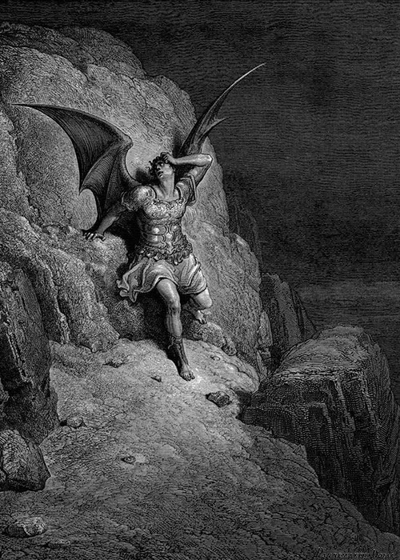

<small>Photo from <a href="https://digital.lib.buffalo.edu/items/browse/tag/Paradise+Lost">Gustave Doré</a></small>

Using the analogy of Lucifer, who according to the Hebrew bible is depicted as the fallen angel who was outcaste from heaven to become Satan, the Lucifer Effect describes the phenomenon for ordinary, average good people to turn bad and perpetrate evil acts. 

The transition of ordinary people into bad people is a fascinating question. In a book that followed the events at the Abu Ghraib in 2003-2004, where a series of disturbing images surfaced that showed the United States Army members abusing Iraqi prisoners, author Philip Zimbardo explored the question: What makes people turn bad? In his book The Lucifer Effect, Zimbardo attempts to understand the stages in the transformation of human character to go bad or evil, through experiments on ordinary, healthy, subjects. Using his own experiments as well as other social experiments that exposes the human capacity to evil, the book examines subjects in controlled settings who are given the opportunity to commit acts that is deviant from what should be considered ethical. 

In 1971, a study known as Stanford Prison Experiment was carried out where people were given roles of prisoners and guards for the course of 2 weeks. In the study, the subjects internalized their roles so effectively that the experiment had to be cancelled within 6 days due to the unethical behaviours of the subjects. The study found that people will readily conform to the social roles they are expected to play when provided with an ideology and social and institutional support. The evidence from the experiment supported the idea that human beings were capable of evil acts when given the approval from an authority, and the study explained how the Holocaust was possible with so many bystanders who persecuted an entire population. Another phenomenon that is closely related to the Lucifer effect is the bystander effect. The bystander effect is a psychological phenomenon that describes the unlikelihood for a person to help another person in distress when there are more people present. According to Fischer, in the 2011 journal of Psychological Bulletin, factors that increase the likelihood for the bystander effect to occur are “the number of people present in the event, possibility of most people around being strangers to you, and the ratio of females to males.” 

There are several accounts that support the legitimacy of the bystander effect. Also known as the Genovese syndrome, the term was popularized by the 1964 account of a woman who was murdered near an apartment complex in Queens, New York. The story gained national atention due to the details of the murder, where it was reported many people were aware of the murder taking place but choosing not to do anything about it. In 2011, a video surfaced where a two-year-old girl in China named Wang Yue, was hit by a small van yet no one moved her dying body away from incoming traffic. 

Incidents such as these beckon the question: What is the limit to human apathy? Are all human beings susceptible to the ways of evil? It seems only natural to come into the aid of someone in need of dire medical attention, yet the bystander effect illustrates that most people will not be the first one to make the active decision to help someone. 

As unpopular as the idea may be, all humans do carry a capacity to commit acts of evil. Every day, the world is full of violence. It is a time of global economical crisis and school shootings, and behind each of these events, lies a person or persons who have actively perpetrated these acts. It is a frightening idea, that the more people there are around you when you are in trouble, the less likely it is for anyone to help you when you need it. Every day, we as a society are given a choice to look the other way, and we often take it. Murders have become normalized, and we as a society have become desensitized to violence and to acts of evil. 

In his book, Philip Zimbardo mentions the “Human capability to evil, but also the human potential to be heroes.” His definition of hero includes the average, everyday heroes. While every individual is moved by situational forces, such as the group mentality and the bystander effect, the individual also has the choice to resist the urge to become compliant. Everyone has the potential to be the whistleblowers and overcome fear to be a hero. 

We live in a dangerous world, and that may have a direct consequence on the kind of lives we live. Understanding the Lucifer Effect might be first step in realizing one’s capacity to evil, but also their potential to act upon a conscious decision to prevent evil in the face of fear. The Lucifer Effect, and the bystander effect does not have to define our society by their studies and experiments but rather the stories of heroes in our everyday lives. 

In 2013, Antoinette Tuff stood by a shooter of her Atlanta school, and was able to calm down the shooter into retreat, saving the entire school from becoming a yet another tragic school shooting story. She took a drastic personal risk to sympathize with the shooter, and made an active decision to act in her situation. Ordinary people might have the capacity to evil, but they can certainly also be ordinary heroes in their lives. 

Humans possess a duality of both bad and good. The decision lies on the hands of the individual to choose their destiny. The capacity to be good, as well as evil, must be met with the personal choice to become a perpetrator, or a hero in their everyday lives.
