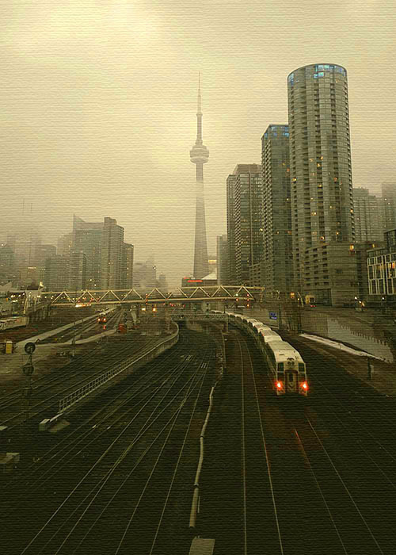

<small>Photo from <a href="https://www.instagram.com/p/-9QYyIu8EK/?taken-by=soteeoh">paula-youth</a></small>

In a 2009 city wide survey, it was reported that 4,390 homeless persons were found out in the streets of Toronto in any given night. Most take shelter in government support and housing services, and in parks and sidewalks. People freeze to death every winter in this cold city. 

When I was living in downtown Toronto, in the heart and center of Bloor and Young street, there was one particular man who always sat on the bench behind my building. Feeling particularly grateful on my pay day (first of my life), I ran into the old man on my way home. I had a particular soft spot for the old man who I saw everyday by my house on my way home from school, and seeing him that night in his sombre mood holding an empty coffee cup made me quickly walk up to him and hand him a twenty dollar bill. 

“Are you sure you want to give this to me, son?” 

I put the bill in his empty coffee cup. Then I quickly walked away, thinking not much, maybe feeling a little useful, the words from Sunday service echoing in my head about sharing your wealth to the needy. His voice was incredibly gentle, and I thought that he sounded quite normal, perhaps more normal than I expected a homeless man to be. 

That was the first and last time I was able to speak with him. I found out the next day that he had passed away. An ambulance, a group of mothers and children on their way to school all gathered by the garbage dump, whispering softly. He had frozen to death. Someone spotted him in the morning after the cold, freezing January night. 

I recognize many homeless people around the downtown area. Maybe not by name, but I recognize them from living in downtown from all these years. Everyone must know Sarvo. For years, every day, he has stayed in his spot and surprised shoppers by screaming “Jesus!” into their ear. He is the first thing I look for whenever I am by Eaton Center - he represents a kind of staple mark for the city. He has stood there for years, withstanding the cold. Some do not survive. 

Every year people freeze to death in this cold city. The homeless are real people, with families and loved ones. They are someone’s son or daughter, they are somebody’s. The man I gave the twenty dollar bill to, always had a young man in his thirties visit him with a cup of coffee and angry arm gestures. I think he was family. Those who live on the street might seem alone, but they exist as part of the community. People notice when they go missing. They have needs and suffer just like anyone else. 

I learned that day that life is a funny, funny thing that I could not quite understand. I learned that people are very peculiar beings. The lack of empathy that soaks the air when I walk between the high-rising towers and condos downtown - sometimes it frightens me to no end. We are all like mindless little ants, going somewhere and working until we die. We pay no heed to those who are suffering so much in front of us. 

Life is not always kind to those on the streets. No life in this world deserves to be ignored up until their last moment.

List of Emergency Shelters and Services in Toronto

Lawyers Feeding the Hungry
Eva’s Initiatives
Covenant House Toronto
List of Other Services
