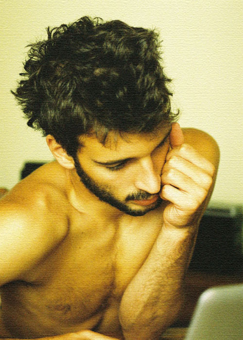

<small>Photo from <a href="https://t.umblr.com/redirect?z=https%3A%2F%2Fwww.flickr.com%2Fphotos%2Ftesourinho%2F6170685877%2Fin%2Fphotosof-boooooobie%2F&t=MDBiNGE0M2VjMjJkOThjYzU1ZjIwZTZiMDFlYTA2MzZmOGVlODIzOCw3MVlhOXYzdg%3D%3D&b=t%3A2tF3hWVD2lUpt_wUkxXQjw&p=https%3A%2F%2Fjuded.tumblr.com%2Fpost%2F146045763637%2Fquarterlife-crisis&m=1">Tomás Canha</a></small>

No one is out there telling us how to live our lives. 

What do you mean?

Us twenty-something year olds. With our whole thing of transitioning into the job market, dating market, losing friends, making friends, paying off school debt and earning enough for rent. No one taught us how to do any of this. 

I guess.

Have you seen the people at the bar last night? All young, all in our twenties. We were all so… lost. No one there knew what they were doing with themselves in there. Everyone seemed so jaded. 

I had fun.

You had fun standing around all night with drunken people screaming at each other? 

The after-party was fun.

Sure, if you consider people snorting cocaine off the toilet seats in the bathroom fun. Nobody bothered to tell us this was going to happen. What are we doing with our lives? 

Why do you feel like you need someone to tell you how to live your life?

Because that’s how I’ve always lived, there was always somebody there telling me what to do. Think about it. Think back to high school, the years when we lived for free, ate for free, studied for free. We went to college, thinking we were doing the responsible thing for our future, but what we were really doing was delaying reality. We extended that high school hiatus of everything being free to us for four more years. It was fun, and I learned stuff, sure, but the debt stacked up and so did my tolerance to alcohol. Now here I am supposedly “all grown up”, but all I am is I’m in debt, and all I’m doing is drinking myself silly. This morning I suddenly felt this overwhelming pressure to pick up this month’s issue of the Economist and read it cover to cover. 

This morning we watched an episode of the Weekenders, where Tino’s mom made fried rabbit for dinner.

Exactly. What are we doing with our lives? 

We’re just trying to live.

…Towards what though? 

Life has changed. Today, a Master’s degree is the new the college degree, and college degrees are the new high school diplomas. Nowadays, high school drop-outs are the people who really got their shit together. 

Looking back, it is almost ridiculous what the education system demands out of teenagers. Forcing a 17-year-old to make the biggest decision of their lives about their career path is utterly disastrous. Without the proper experience and knowledge of what is out there, the youth are doomed to wonder and waste their precious years searching for a calling, instead of actively investing in their career. They often end up in the unfortunate position of multitasking too many skills to never actually become great at anything. Before you know it, all you are left with is nothing but a paper diploma to show for the last four years. 

I will admit it first even if no one else is willing to: I am in a quarter-life-crisis. I am afraid to grow up because I delayed it too long. I drink to write about things I don’t understand. I am baby-handled by everyone. I think about relationships too much for someone my age. I refuse to get a driver’s license in fear of getting into an accident, and because I cannot afford a car. And for the past three years I have shamelessly declared my plans to travel across Europe, but still haven’t had the guts to actually purchase the plane ticket. I am in a rut. A quarter-life-crisis kind of rut. And before I know it I will wake up with a beer belly and a streak of failed relationships, and that is when the real midlife crisis will hit, and then little by little I will die inside, with my college degree rotting away under some stashed box behind the closet. 

I feel like a gypsy, drifting from one job to internship to interviews, never quite finding a place to call home. Most days I find myself in a fetal position on the floor with a carton of strawberry milk by the side of my head. Other times, I go to coffee shops and write in the hopes of making it as a writer, or some sort of a free, creative individual, whatever that means. I am literally wasting my youth away. These are the years when I should be the best-looking without actually trying, when my skin glows even after a night of drinking, when I am most fertile and healthy and strong – yet these very years are passing by me as I watch them disappear into yesterdays. 

Youth is a double-edged sword. Knowing this will not last forever makes you want to enjoy the ride as much as you can, but at the same time your inexperience inhibits you. 

We, the millennials, Generation Y - We thought we were the best generation ever, never before did a generation have this much freedom and potential. We thought the road was paved for us, because they repeatedly told us how easy life was going to be if only we (fill in the blank). So, we did everything that they told us to do, what they told us will grant us success. We pushed in the hours and pulled the late nighters, we worked hard for years to stay on top. But now we find ourselves at the finishing line, only to realize the finishing line is actually just an entryway into another waiting line with thousands of others just like us, looking at each other and going “You too?” 

It is time to meet reality. No more lies being told to a whole generation. No more false expectations and intimidation blatant lies being installed onto a whole demographic. The reality is that today’s economy is struggling hard. The truth is that everyone in their twenties is capable of the jobs that they apply to. Remember that job that you really wanted to get but didn’t? You didn’t get that job, not because you weren’t good enough, or have enough experiences; but because there was someone else, just like you, who got there first. They had better timing, better connections, better luck. They knew someone who worked there. Someone knew them who worked at the company. 

Another reality-check: Remember that job that you thought sounded awesome? The one with great pay and good coverage and decent vacation? Well, as much as you might have forced yourself to believe that it was the perfect job for you, it is very likely that it wasn’t your dream job at all. In five years time, that job will probably look pretty pathetic in hindsight. Nobody wants to live by their phones picking up dry-cleaning and lunch for their boss, nobody wants to put in a full-time’s work and not get paid for it. We did not major in our respective fields for its respectively required years, just to have someone tell us we are no better than high school teenagers. We were motivated enough, wise enough, to plan long-term. We are the exceptional in our population. We deserve the jobs that we truly desire. That one job that we want so bad we can’t even imagine what it would be like if we didn’t get it. The problem with the quarter-life-crisis of twenty-something-year-olds - and this includes me right in the front of everyone else – is that we don’t know what we truly want, or even if we do, we are afraid to go after it, because rejection at this point feels as familiar as three meals a day. 

After we graduated we thought our lives were supposed to start immediately, like some missile being launched into space and exploding into something amazing and beautiful. But the reality of the situation is that that the hard road actually begins here. The truly unadulterated real world is now at our doorsteps. We cannot be so naïve in believing things are handed down to us anymore. If we continue to believe that things are simply suppose to work out for us, we will forever be stuck in this quarter-life-crisis, where we will forever measure our shame by the number of dirty dishes that are in our rooms (or maybe that’s just me). 

We are an unfortunate generation. This sounds grossly exaggerated and immensely spoiled, I know, but someone has to speak for the thousands of disheartened young men and women out there. Someone has to admit just how much this all sucks. We have worked hard and come far, only to be told we were not alone in our fruitless endeavours. But in this contemporary life, we cannot dwell in the past, or what anybody says to dampen the last bit of hope we have in ourselves. Every one of us is worthy of the lives that we truly desire. We have already proved to society that we are contributing citizens of this country with our degrees, no matter how useless they say they are. That plaque is a symbol of our naiveté to believe whatever adults told us – but it is also the symbol of our hard work, our sweat and tears. Take pride in your degrees. Take pride in your education. Take pride in your own unique skills and personality. We managed to get here, and we should think long-term and work hard from now on onwards. Behind the question “So where do you really want to work?” lies the true dream of that person, and that dream must be realized before it is truly too late. 

If you can avert the quarter-life-crisis, the better luck you have of avoiding the mid-life-crisis. That is when everything will truly fall apart, anyways. We have youth our side. And we should continue to stubbornly chase after the dreams we have despite what the world has repeatedly told us. We should charge at the world, in the style of the twenty-somethings of the twentieth century: bold, stubborn, daring, and through the web. If we can manage to continue working towards our dreams starting now, and not lose our motivation, someday, hopefully, the hard work we invest in ourselves will pay off.