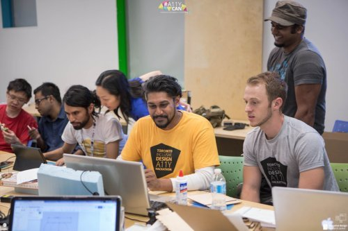
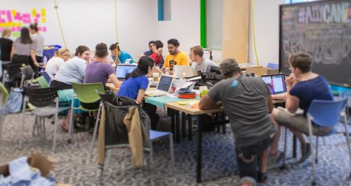
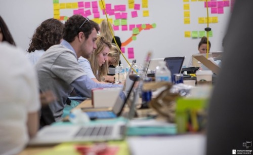

Inclusive Design - #A11yCAN 

Professor St.Cyr notified me a week ago that OCAD Univeristy will be hosting a Hackathon on October 12/13, a Wednesday (when we have his class, does not want me to come?) and a Thursday (morning class, shoot). However, I was determined to go: a chance to create and innovate a new technology that can help people with disabilities? Sign me up!! 

At first me and my group began brainstorming ideas about wheelchair accessibilities for students and their access to classroom chairs and desks. We wanted to create a new way to integrate accessibility to existing classrooms rather than simply creating an “open” space or leaving a space empty where a wheelchair is just assumed to fit. However, with the brief introduction from our instructor, we learned that last year Uber partnered up with Canada’s National Design & Architecture Exposition & Conference to create accessible Uber experience for people of disabilities. We discovered we want to move our focus onto mobile application. (That idea will be kept in my back pocket until further notice!) 

We spent the morning brainstorming ideas about web accessibility. I currently work as a Graduate Student Assistant for the Information Technology Services at the University of Toronto, and one of my various project include making every UofT site assessible to people with disabilities, including visually-impaired, deaf, deaf-blind individuals. Ontario is the first Canadian province to put place a law that states all websites must be web assessible by 2025. I pitched the idea to the group and immediately everyone was interested. We worked to create an online tool that not only tests websites in whether they are assesible into “pass” or “fail”, but rather an add-on desktop app (mobile too I guess) like Chrome Add-On, that can give warnings to users with disabilities when there is a website that is not web assessible. 

After initial phases of designing and coding (by some of our programmers in the team!) I had to leave for class. Professor St.Cyr, why did you tell your students to attend this Hackathon, on the day you were teaching your class?! It seemed I was the only student from University of Toronto. Either way, I apologized to my group and left. I hope they took that idea and made something amazing out of it. 

Web assessibility is not only for the visually-impaired. For people with a pre-existing conditions for seizures induced by visual stimulation, websites that are not properly assessibility-tested can be fatal. Making the web and the internet assessible helps all of us, not just for people with a “disability”. 2025 is a long way away, and it dawns on me that people should have forseen this need much sooner, many years ago… 
