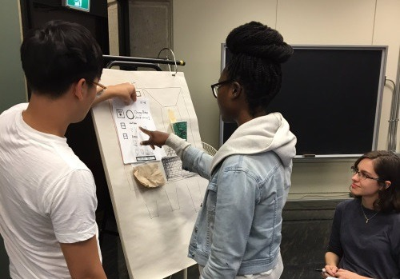
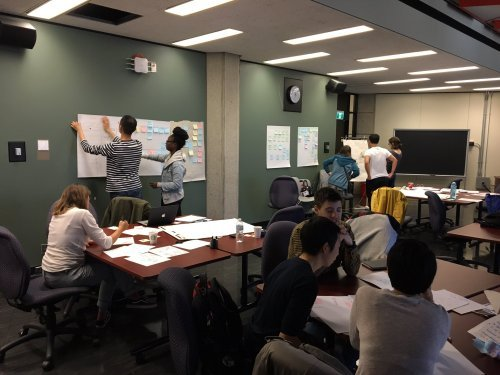
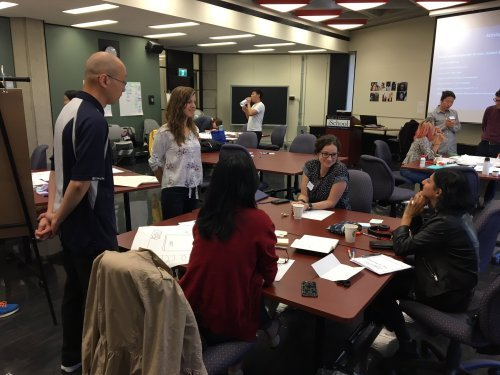

User Experince: From Vision to Validation 

We spent a full day designing a prototype of a vending machine. The Faculty of Information with the Association for Computing Machinery hosted yet another iSkills workshop (at this point, I am pretty sure I attended every iSkills workshops offered at the school), this time teaching students the full process of a UX designer. Tim & Christina from RBC dropped by to instruct and help the student groups in creating their own unique vending machine. 

Me and my teammates were tasked with designing a free tea dispenser for the Faculty of Information students (I wish!!). I worked with students I have never worked with before, and that in it self was a fun experience, learning new working styles and personalities in my teammates. Luckily, we had a great sketcher, and great organizer. Post It notes (My personal favourite tool in UX Design) were utilized to stick and move around the prcoess flows, and the artist of our group was tasked with drawing the interface-screenshots of our touch screen moniter for the dispenser. I worked with creating users’ task analysis, and found areas for improvement. 

By noon after bad pizza (I can’t eat vegan cheese that tastes like play-doh), we were ready to user test. One member from each group went around learning each other’s prototypes and various interfaces, and it was in this stage me and my group realized that this UX task was no easy task. Our protype, although carefull designed with each scenarios and user assesibility tasks in mind, had multiple problems where continuously our users were confused by the “Quick Option” tab we had. Clearly, the wording was too confusing for users. The designers thought it was an obvious and useful feature for users who might be in too much of a hurry to pick and choose what kind of tea they want before class. With guidance and tip from Christina, we quickly teared up a piece of paper and wrote “Most Popular Option” - and immediately, the next two users were incredibly satisfied by the option that allowed them to get their teas in two steps or less. Success! And what a learning opportunity for me and my group. I learned that even while user-testing, it is never too late to make last minute adjustments to your prototype. 