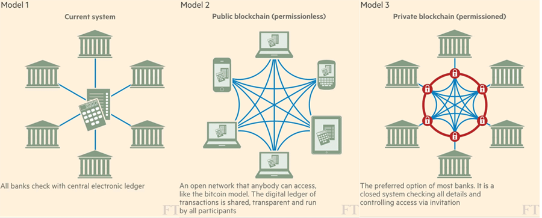

Imagine it’s 500AD, and there are 12 generals surrounding an enemy fort in Rome. Encircling the fort, the generals have a pre-established military order: They must act in agreement to either penetrate or retreat from the enemy fort.
This is the premise of the 1982 paper by Leslie Lamport, Robert Shostak and Marshall Pease that describes the Byzantine Generals Problem, a theory that illustrates the indicative performance of a reliable computer system.

<small>photo by <a href="https://unsplash.com/@markusspiske">Markus Spiske</a> on <a href="https://unsplash.com/photos/FXFz-sW0uwo">Unsplash</a></small>

The power of blockchain lies in its adaptability. Policies are what makes blockchain applications unique from one another. You can design the policies of a blockchain technology to govern its failure system which thus impacts how it operates.
Determining a true or false condition is the central part of any cryptography. As cryptographic processes are central to blockchain and how they work, understanding the fault tolerance of this computer system theory can uncover the true diversity of blockchain technology applications.
The complexity in the problem of the generals is increased by the following 3 aspects:
Treacherous generals who work for the enemy
Treacherous messengers who act on their own agency
Time it takes for a message to reach other generals
In distributed ledger file technology, immutability, traceability, and decentralization of the original file is crucial.

<small>photo from <a href="https://www.ft.com/content/eb1f8256-7b4b-11e5-a1fe-567b37f80b64?source=post_page---------------------------">Financial Times</a></small>

Adopting blockchain to be asuccessful tool involves designing the policies that govern the true or false condition, which can be infinitely more complex as you layer on more aspects into the Byzantine Generals Problem. Rules that govern blockchain technologies and the nature of systems themselves (Public, Private, Hybrid) is all redefining what we can do with blockchain, and the level of security we wish to implement into them.

