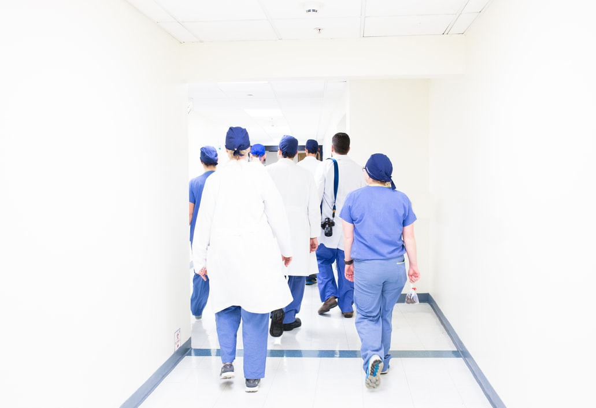
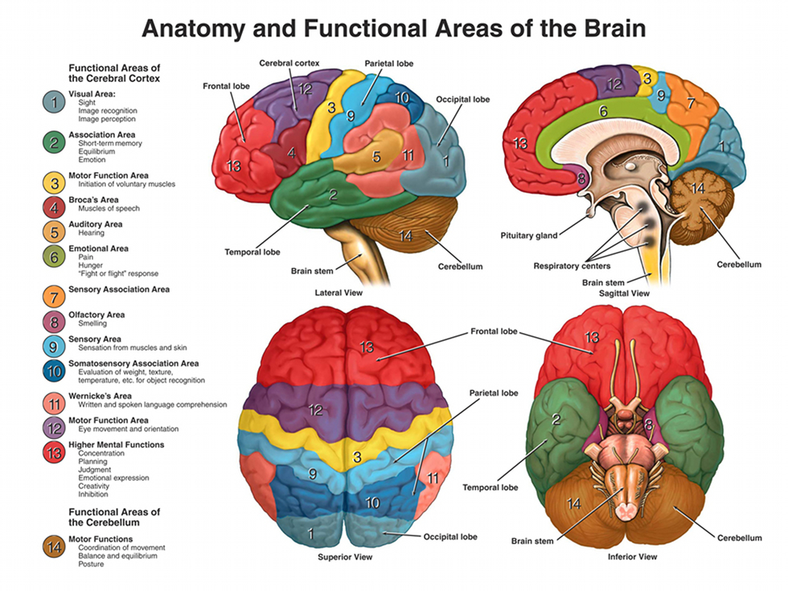
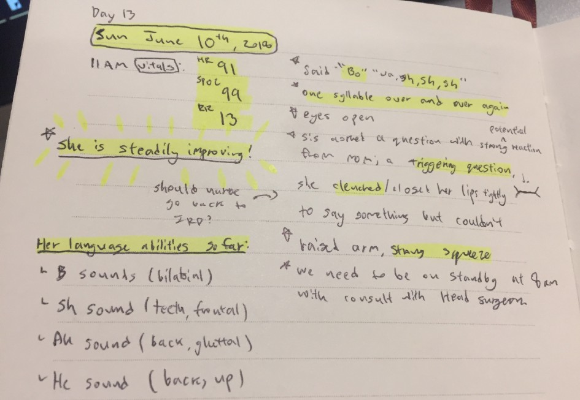
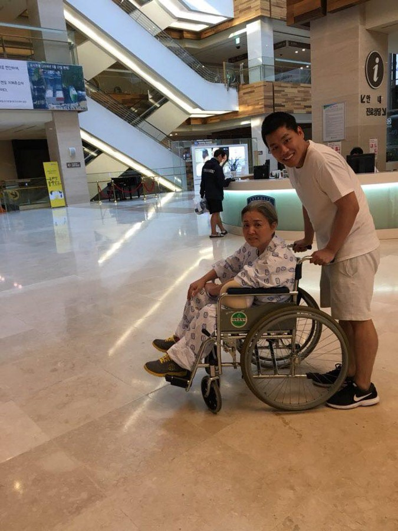
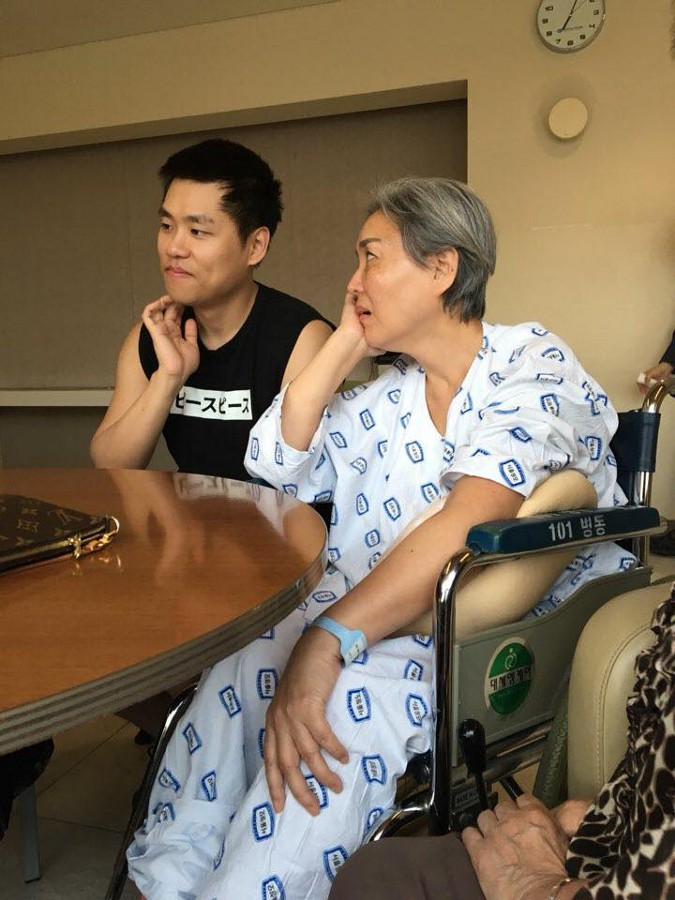
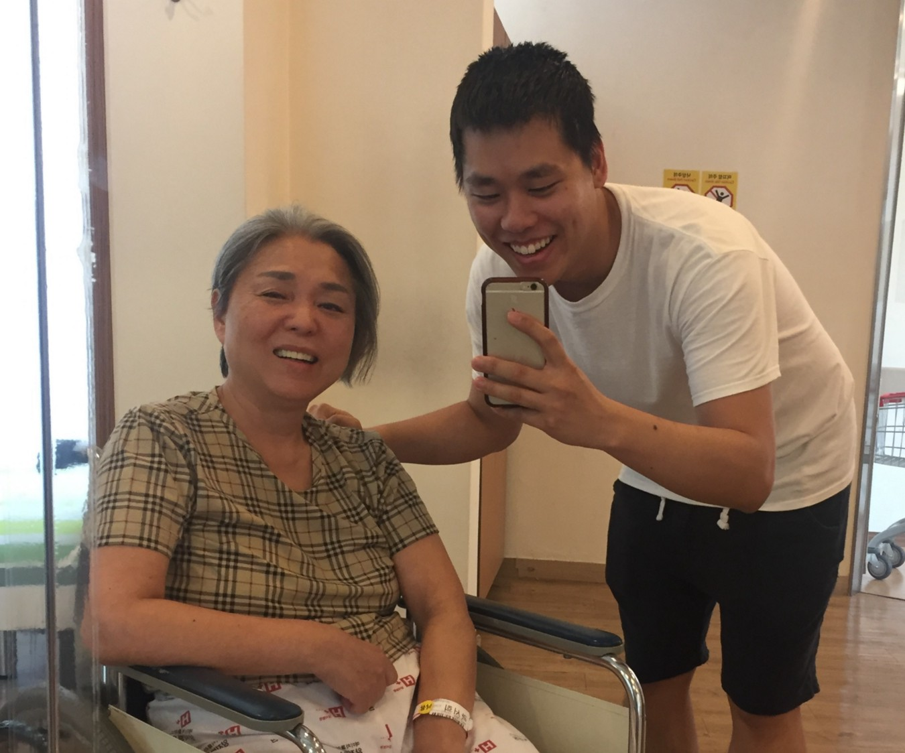

<small>photo by <a href="https://unsplash.com/@lcma1028">Luis Melendez</a> on <a href="https://unsplash.com/photos/Pd4lRfKo16U">Unsplash</a></small>

Today marks day 30 after my mother collapsed from a subarachnoid hemorrage (SAH).

I was half a globe across from my mother when she suffered a life-threatening hemorrhagic stroke. In the 13-hour flight to where she had been hospitalized, I had a lot of questions. What were the survival rates? Was it treatable? Will she be permanently disabled? How did it happen? What is there for me to do as family? As her son?

I spent what was the most intolerable 13 hours of my life writing down everything I could find. I am sharing my experiences for others who may be facing similar circumstances and feel like they are in dark.

<strong>NOTE:</strong> This piece was written specific to my mother’s condition, Subarachnoid Hemorrhage. There are many other types of strokes such as ischemic (clots) strokes.¹ Prognosis depends on the type and locality of stroke, and patient’s history. My mother was treated in South Korea. Each country and hospital have different healthcare policies and regulation that can significantly influence the experience of the patient and their family.

---

##What is Subarachnoid Hemorrhage (SAH)?

Subarachnoid Hemorrhage or SAH is a life-threatening condition where bleeding occurs in the space between the brain and the skull. It is caused by an erupted brain aneurysm, physical trauma or malformed arteries.

It accounts for 5% of all strokes.²

In general, 1/3 of patients may die in the first 24 hours. 1/3 of patients may not make it past the first week. 1/3 will survive.³

At all costs, further complications such as rebleeding must be prevented, which could result in further brain damage or death.

---

##What are the Priorities for the Patient?

The highest priorities for SAH patients in the Intensive Care Unit (ICU) or Neurocritical Care Unit (NCU) are:

1. Prevent rebleeds and other complications
2. Become stabilized
3. Allow the body to recover*

Medication is required and surgery may assist in stabilization of the patient. The patient’s history may play a factor in potential complications.

>*On the medical floors it is often described as “drying up” the blood present in the brain, meaning naturally allowing the body to break down the matter which may take prolonged period of time.

---

##What to expect as a family member:

* <strong>Be prepared to be frustrated by hospital culture and policy:</strong> Depending on the country or hospital or set policies, visiting times for patients in the ICU or NCU may be limited to a certain length and times of day.*

>*My family could only see our patient for only 20 minutes, two times a day.

* <strong>During visits, you may be encouraged to prompt the patient to be alert:</strong> During our visits in the NCU, we were encouraged to speak to her and prompt her for any response, encouraging brain activity. There were many visits where she showed no signs, but we were told some patients later remember everything said to them. We sang to her, showed her photographs, and asked her questions such as “What is my name?” or “Where are we right now?”. Sometimes she could not respond verbally, so we asked her to squeeze her hand for response, once for “yes”, twice for “no.” These visits may also be a good time to ask questions to those in charge of the patient.*

>*In my opinion, these visits are also opportunities for the family to ask nurses or the doctors some important questions such as “Have there been any neurological updates since the last visit?” or “Has they experienced any fevers or infections?”

* <strong>You WILL hear the worst case scenarios from medical professionals:</strong> Medical professionals are legally obligated to present all possible negative outcomes, and trained to minimize words of comfort. During consults with doctors, they will offer grim statements. Be prepared to hear the worst scenarios as a precautionary measure, but do not give up hope based on the consults. Your job as the patient’s family is to keep hopeful and strive for survival.

* <strong>Understand which regions of the brain was affected:</strong> The artery in question and the region of brain affected by SAH will determine the severity and type of disabilities the patient will have. Generally speaking, the brain is divided into the left hemisphere (controlling the right side of body + verbal + memory functions) and the right hemisphere (controlling left side of body + pattern recognition + emotions). Each region of the brain is responsible for specific functions:

<small>Image from <a href="http://a.advancedbrain.com/news/brain_areas.jsp">Advanced Brain Technologies</a></small>

* <strong>Keep a log of the patient’s progress and abilities:</strong> Keeping a detailed log as a family member offers progressive and comparative perspective of the patient that even a detailed medical file cannot capture. Keep a note on their progress, track their will and emotions, words or sounds they utter, their expressed region of discomforts, their movements and sensations in the regions of body affected, and more. This will especially become useful for physio later on — share your notes with the doctors and nurses in charge of the patient. I kept a note of my mother’s linguistic capabilities to understand how speech was affected by the condition:

<small>Image from <a href="http://www.linguamanca.net/linguistics/linguistics_2/linguistics2_page1/index.htm">International Phonetic Alphabet (IPA)</a></small>

<small>My mother’s speech capabilities decreased significantly to none in the first week. I kept a list of all sounds she began to produce again to understand the severity of her loss. I knew that if she made “b” or “p” sound she still knew how to produce bilabial sounds.</small>

---

##Final Note to the Reader:

My mother survived the first 30 days and continues on today with her physio.

<strong>Not every SAH is a death sentence.</strong>

Sometimes as a family member it may feel like there is nothing you can do. But the truth is that the patient’s family is fighting to stay alive — not the doctors or the nurses — but for their loved ones. You are the reason for them to stay alive.
Remember to eat, even if you don’t have the appetite. Sick family members are not allowed see the patients. Do not lose your temper at the hospital staff. Say encouraging and positive things to the patient, recall fond and happy memories, and remind them who they are, who you are — to create a sense of sanctuary in their battle.

Intensive physiotherapy lasts about 2 years, where neuro-patients have a critical window in the first 6 months to experience the most improvements. After 2 years, improvements are none to minor. The most important variable in physiotherapy is the patient’s will. If they are motivated and train hard, the abilities they will regain will be far more greater than someone without motivation. Patients will also experience depression, at succumbing to a life-threatening medical condition, and in reflection over the abilities they lost. I had doctors warn me that the real journey begins after stabilization, as the recovery process is slow and long.

Permanent disabilities are expected. The danger of rebleeding for SAH patients do not quite go away, and the patient should be monitored.

If you need to reach out to someone about the experiences of SAH condition from the perspective of a family member, you can reach me at jude[at]judepark.com.

One of my goals for writing this was to provide a voice of comfort — something that no medical professional gave us during our difficult time. Take it day by day, moment by moment.

---

##Useful Resources

1. Types of Strokes: https://www.strokeassociation.org/STROKEORG/AboutStroke/TypesofStroke/Types-of-Stroke_UCM_308531_SubHomePage.jsp#
2. Predictive Factors for Rebleeding SAH: https://www.ahajournals.org/doi/10.1161/STROKEAHA.115.010037
3. Quick Stats on SAH: https://www.mayfieldclinic.com/PE-SAH.HTM
4. Types of Cerebral Aneurysms: https://www.joeniekrofoundation.com/understanding/types-of-cerebral-aneurysms/
5. Video — What is Hemorrhagic Stroke?: https://www.youtube.com/watch?v=tPly_gJsTHs&t=25s
6. Image of Brain Regions and Functionalities: http://a.advancedbrain.com/news/brain_areas.jsp
7. Phonetic Chart and Breakdown of Speech Capabilities: (http://www.linguamanca.net/linguistics/linguistics_2/linguistics2_page1/index.htm)

---

##Medical Terminologies on SAH:

<strong>Subarachnoid Hemorrhage (SAH):</strong> a life-threatening condition where bleeding occurs in the space between the brain and the cranium.

<strong>Intracranial Pressure (ICP):</strong> the space between the brain and the cranium is filled with cerebrospinal fluid (CSF), a clear fluid that act as a cushion for the brain. When bleeding occurs it can increase the pressure causing the brain to swell and become damaged.

<strong>Hydrocephalus:</strong> a dangerous condition where there is an accumulation of CSF within the brain, which may cause brain damage. Should look out for scans of the brain, droopiness, sleepiness and lack of urinary control.

<strong>Vasospasm:</strong> a dangerous condition where the arteries in the brain constrict uncontrollably due to the contact of brain matter and exposed blood, leading to further brain damage. SAH patients should routinely receive specific medications to prevent this condition from occurring in the first months.

<strong>Tachycardia:</strong> More widely known as increased heart rate, it is common among critical patients in the ICU or NCU. As the patient stabilizes it will likely disappear.

<strong>Thunderclap Headache:</strong> Individuals who experience SAH often describe the onset with an accompanied headache that is widely expressed as the “worst headache of all time” or “thunderclap headache”. Other signs and symptoms include difficulty and pain in moving the neck, speech difficulty, facial droop and/or limb weakness.

<strong>Stroke vs. Aneurysm:</strong> Although different under medical terms, these are interchangeable terms that I noticed even doctors used in combination. A stroke is condition where an artery may be blocked or rupture requiring immediate medical attention. A brain aneurysm is a condition where an artery in the brain presents localized malformation (ie. enlargement or weakening of artery wall). Both conditions when ruptured require immediate medical attention.

<strong>Types of Aneurysms⁴:</strong> A brain aneurysm could protrude like a tiny balloon (Saccular), or the entire artery wall may become enlarge (Fusiform), or the artery wall may weaken over time leading to a “dissection” within the artery (Pseudoaneursym). Any one of these could lead to SAH.

Image by Stanford Health Care (https://stanfordhealthcare.org/medical-conditions/blood-heart-circulation/thoracic-aortic-aneurysm/types.html)

My mother suffered a rare cerebral aneurysm dissection. My mother was healthy without any prior medical disorders.

---

##Medical treatments of SAH:

<strong>Computerized Tomography (CT):</strong> non-invasive medical imaging technique to visualize the brain. CT will present regions of bleeding in the brain.
Magnetic Resonance Imaging (MRI): non-invasive medical imaging technique to visualize the brain. MRI will present regions of the brain affected and loss of brain cells.

<strong>Angiography:</strong> a medical imaging technique used to visualize the blood vessels in the body, where ink-like substance is injected through the arteries. The site of injection is usually at the femoral artery in the thigh that travels its way into the brain.

<strong>Ultrasound:</strong> non-invasive medical imaging technique to detect possible hydrocephalus.

<strong>Stent Operation:</strong> a medical operation where a tiny metal or plastic tube is inserted in a damaged artery passageway to allow blood flow.

My mother’s affected artery was over 15mm long, requiring stent operation. A tube was inserted inside the artery to act as the wall of what was a ruptured or weakened artery. It should be noted the doctors themselves will likely not know which reparative actions to take until they are in surgery and reach the site of concern.

<strong>Endovascular Coiling:</strong> a medical operation to fill an aneurysm with flexible platinum wires to block blood flow to protruding vessel.

<strong>Clipping:</strong> an invasive medical operation to isolate and block off blood flow circulation to the affected artery. May or may not lead to permanent disability.

---

MC + MSN[^1] helps to categorize which requirements are necessary that rely on each other for it to be accomplished. It gives the opportunity to evaluate the gains and losses of each feature/step for the ideal outcome. The MoSCoW technique tackles the issue of prioritization — when stakeholder pressure or a personal tragedy strikes, simple techniques can save you trouble.

In moments of utter disorder — just remember Mariah Carey sitting on a computer using MSN. It might help you out.

[^1]:
  The MC + MSN principle comes from the <a href="https://www.agilebusiness.org/content/moscow-prioritisation">MoSCoW Method</a>, which is an agile project delivery method developed by Dai Clegg in Oracle.
